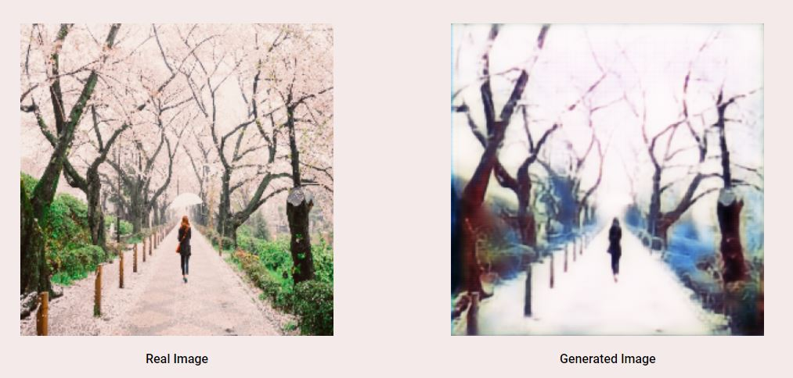
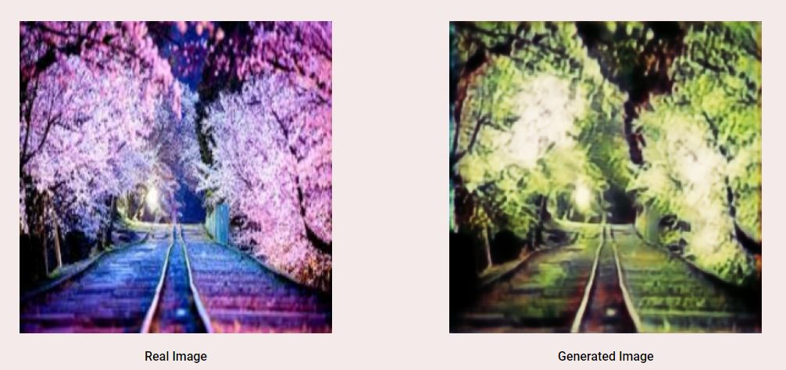
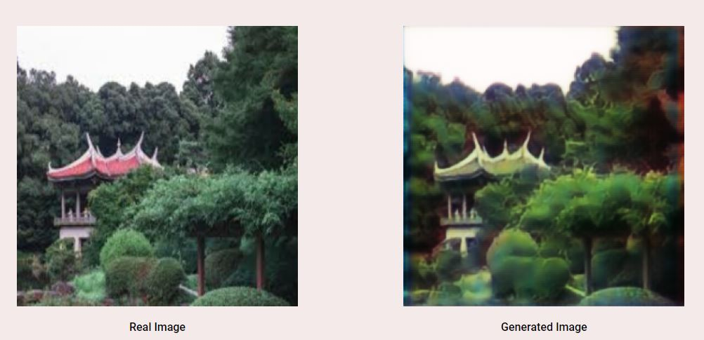
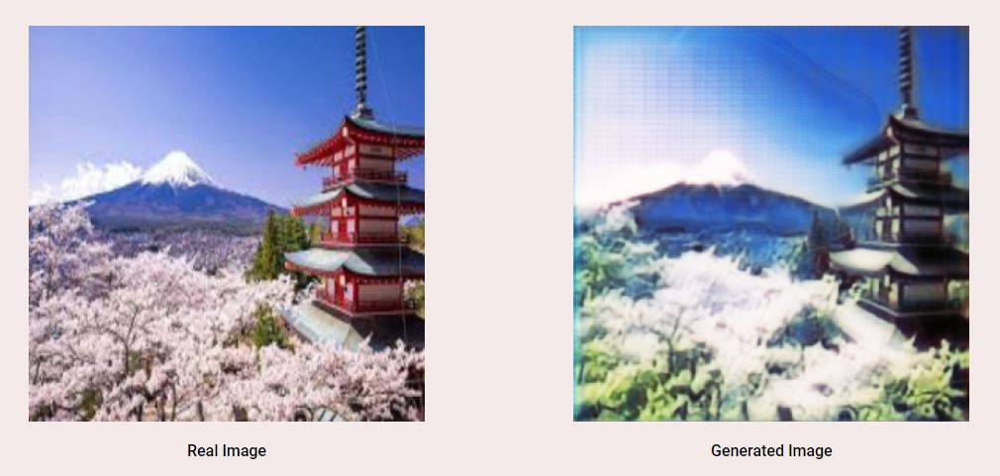
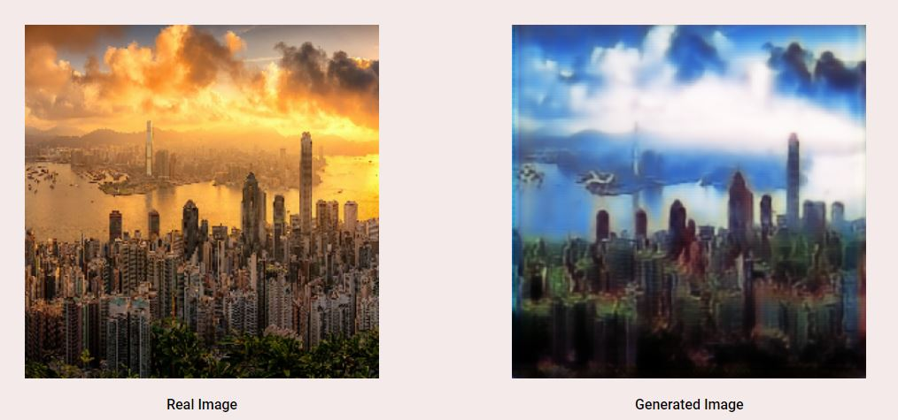
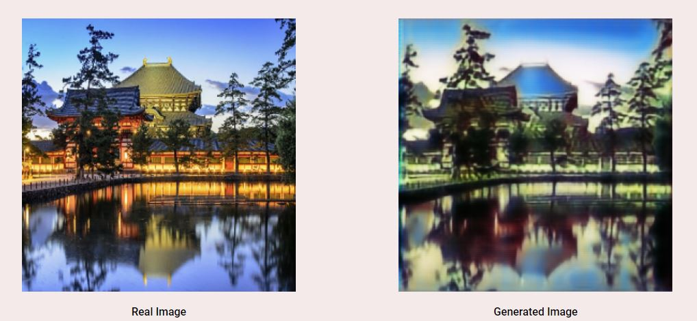
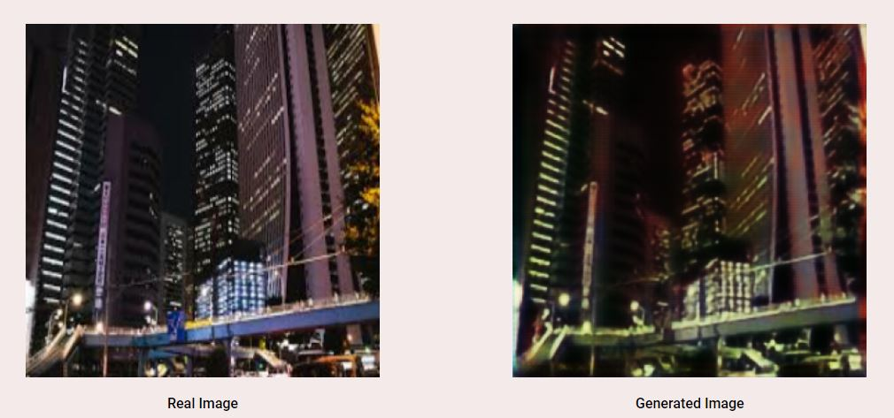

# Image Styling Using Generative Adversarial Network
# This project is made by Me and <a href='https://github.com/rahulthaker'> Rahulthaker </a>

> A model made using GAN and style Transfer to convert real world images to animated style images 

---

